# RVPC Build Guide

To assemble our RVPC, we will follow the recommended order of assembly in the original [user manual](./DOCUMENTS/RVPC-user-manual.pdf), adding a few extra clarifications, photos and tips.

[photo of RVPC workshop]

## Rough Schedule

1. Introduction (10 minutes)
2. SMD soldering of the RISCV chip (20 minutes)
3. Through hole soldering of all other components (45 minutes)
4. Testing and flashing (15 minutes)

Here is an overview from the manual showing the front side of the board once fully assembled, highlighting the key components:

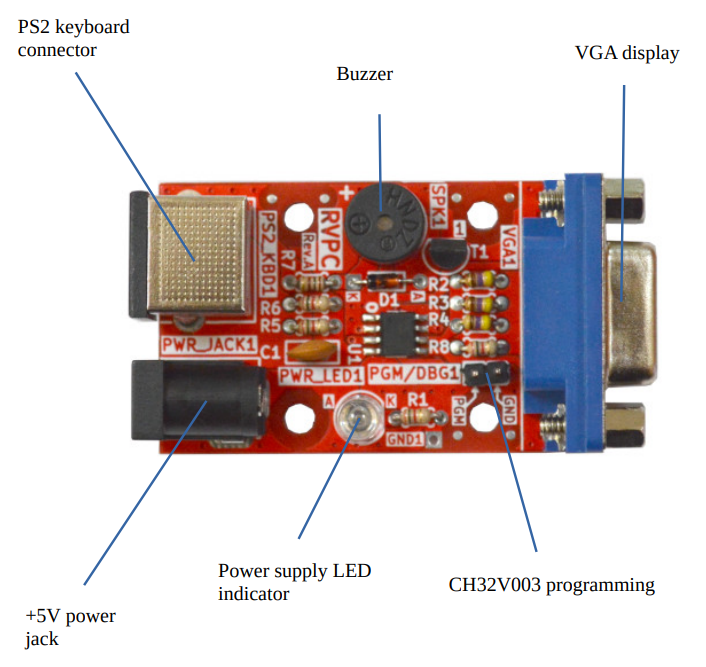

## Soldering techniques: THT vs SMT

The RVPC contains elements of both THT and SMT soldering. Let's review the basics:

- SMT means 'surface mount'
	- A modern technique to aid automated assembly (pick and place)
	- Components are typically placed on one side of the board only
	- No holes needed!
	- Can be performed with a hot plate, reflow station or soldering iron with fine tip
	- Components can be very small (sneeze, you lose!)
	- Tweezers help!

- THT means 'through hole'
	- An older technique but (arguably) easier for humans and for DIY
	- Components are inserted into holes on the front side of the board
	- The actual soldering takes place on the opposite side
	

## Step 0: Getting Started Laying Out the Components 

Now is a good time to open up the bag, familiarise yourself with each component and check everything is there.

Here is a summary Bill of Materials (BOM) of all the components of the RVPC, in the recommended order of assembly:

[table]

| Step | Number | Code | Description |
|------|--------|------|-------------|
| 1    | 1      | --   | Printed Circuit Board |
| 2    | 1      | U1   | CH32V003J4M6(SOP8) |
| 3    | 1      | R7   | 100Ω Resistor BROWN-BLACK-BROWN-GOLD |
| 4    | 3      | R2, R3, R4 | 470Ω Resistor YELLOW-PURPLE-BROWN |
| 5    | 4      | R1, R5, R6, R8 | 2k Resistor RED-BLACK-RED-GOLD |
| 6    | 1      | D1   | 1N4148 Diode |
| 7    | 1      | C1   | 100nF (marked 104) |
| 8    | 1      | T1   | 2N3904 Transistor (NPN) |
| 9    | 1      | PWR_LED1 | 5mm LED (red)  |
| 10    | 1      | SPK1 | Speaker/Buzzer |
| 11   | 1      | PGM/DBG1 | 2-pin header |
| 12   | 1      | PS2_KBD1 | PS2 keyboard connector (Mini-DIN) |
| 13   | 1      | VGA1 | VGA connector |
| 14   | 1      | PWR_JACK1 | Barrel Power Jack (2mm - YDJ-1134)|

### Key Points About the Build

- Pay special attention to the orientation of the CH32V003 chip. There is a small black circle on the chip itself, which should orient towards the white circle on the board

- Don't forgot to complete the last step, to bridge one set of the red, green or blue terminals on the back of the board (otherwise nothing will appear on the screen!)

- Use a 5V power supply only! 9V or higher will burn the chip. We use a standard phone charger and a USB to barrel jack cable.

## Step 1: Inspecting the Printed Circuit Board

First take a good look at the PCB, to differentiate the front and back sides and identify where to place each component using the codes above. All components are placed on the front side of the board.

Front side:
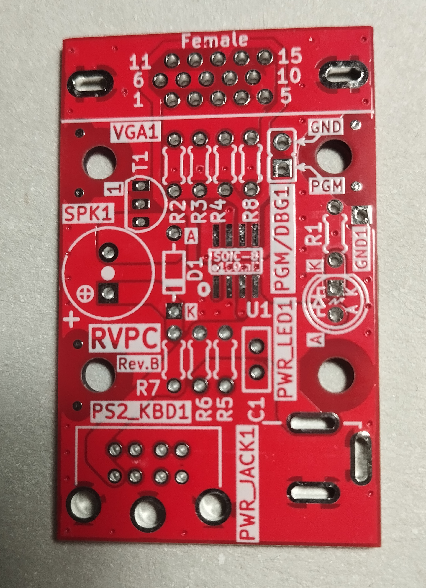

Back side:
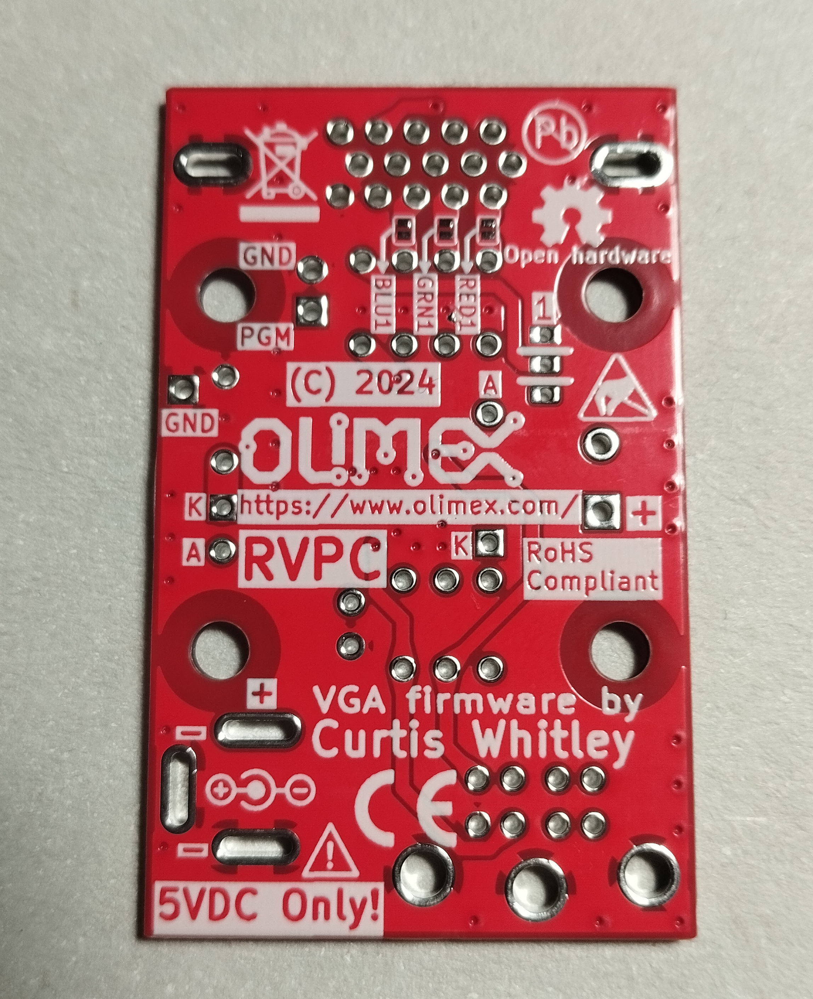

## Step 2: CH32V003 RISC-V Microcontroller Unit

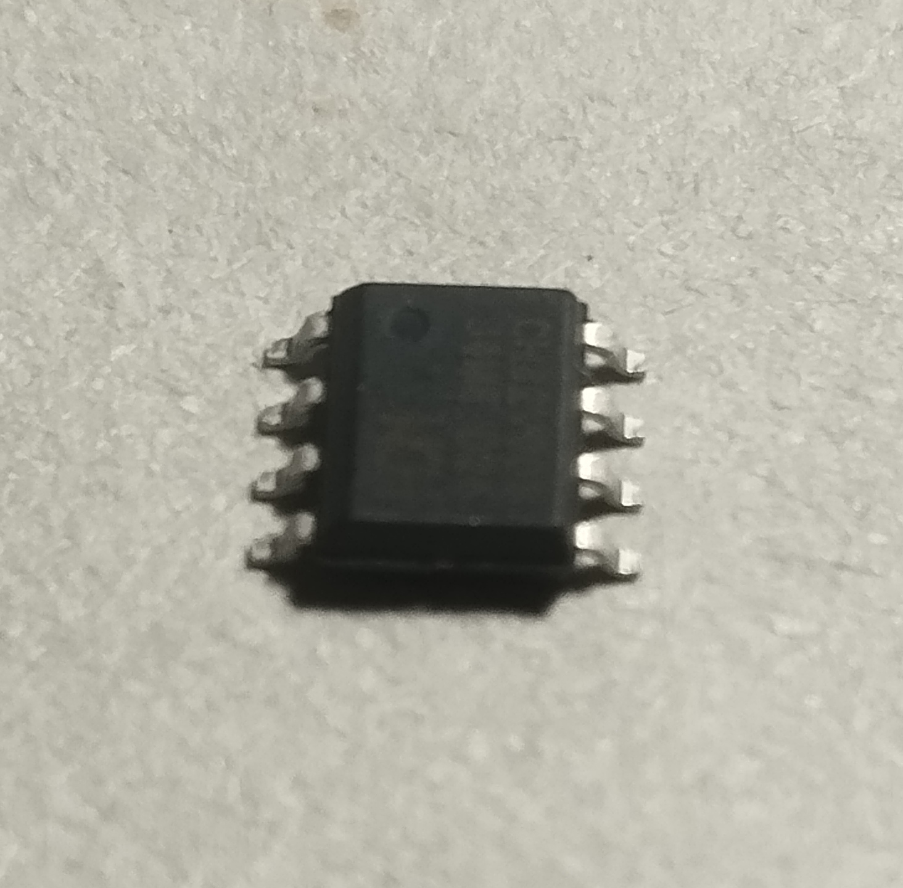

- This is marked U1 on the board and it will be the brains of our PC
- It is the trickiest element to solder correctly, because it's the smallest!
- It is a surface-mount (SMT) component meaning it is soldered to the front side of the board only
- Orientation of the chip _matters_. Match the small black circle on the chip with the white circle on the board

There are three ways solder this one, as described below. Whichever method you choose, it's good to have a pair of tweezers at hand to hold the chip in place. Working in pairs is also a good idea. If you have more experience, please help the others on your table to get this right!

### Method 1: Hot plate

We have set up some hot plate in the room if you want to try this method. The process goes as follows:

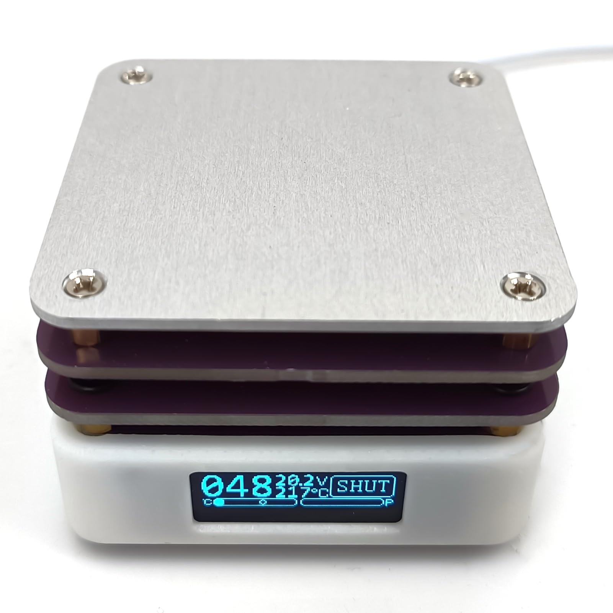
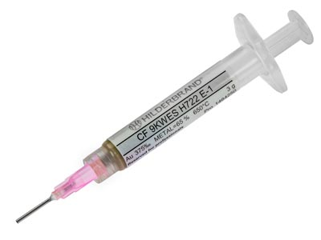

1. Using the syringe provided, place a small amount of solder paste on each of the U1 pads (silver areas)
2. Place your RVPC circuit board on the hot plate, front-side up
3. Use tweezers to carefully place the chip on top of pads that you previously put the  solder paste onto. Pay attention to orientation! Match the small black circle on the chip with the white circle on the board
4. Heat the hot plate to 160°C and wait until you see the solder melt. Increase the temperature slowly if you don't see any result with in a few minutes.

### Method 2: Soldering iron (with fine tip)

It is also possible to solder the chip by hand, if you have a steady hand. It helps to have an extra person to hold the chip in place, leaving you both hands free to hold the iron in place and apply the solder.

Here we won't use solder paste, just normal solder tin.

1. Start with a corner leg of the chip
2. Hold the component in place with the tweezers
3. Use the soldering iron to apply heat to the pad and the leg together. Be careful not overapply solder (thinner solder helps here)
4. Move on to solder the opposite corner leg, then all the remaining pins

### Method 3: Hot-air rework station

Another alternative is to use a hot-air rework station. We have one available to try. This is essentially a very directional heat gun. Here's a quick guide:

1. Using the syringe provided, place a small amount of solder paste on each of the U1 pads (silver areas)
2. Set up the hot-air station and start with temperature low (around 300°C)
3. Aim the hot air gun at one side of legs of your chip and wait until the solder paste melts and fuses the legs to the pads
4. Move around to the other side of the chip legs and repeat

## Through-hole Soldering Basics

Congratulations, from here on in it gets easier! The rest of the components in the build are all through-hole (THT) and a bit more human-friendly to work with.

Here are some basic tips for working with a soldering iron. If you already have experience, move on to [Step 3](#step-3-100Ω-resistor)

- A good iron should have a silvery tip and solder should run easily onto it at a standard temp of around 340 degrees. Don't start soldering components until this is the case!

- To get an iron in good shape: rotate the iron whilst applying solder to the tip to find a spot where the solder melts. Try to expand on this spot until the whole tip is silvery and solder melts everywhere. Return to this process anytime you notice the iron's performance deteriorating.

- Don't worry about wasting a little solder. When there's too much just clean up the tip on a wet sponge or wire brush as you go. 

### Silver rules of soldering

In soldering, we like silver - not golden - rules!

1. Apply the principle 'heat the place you want the solder to go'. Often this is both 'pad' and 'pin'.
2. Not too little, not too much solder: too little and the connection won't be solid, too much and you risk bridging other components
3. Solder should always 'fuse' to the pad, not ball up on top. If this happens, apply heat the the pad to encourage the solder the flow down in place
4. Start with temperature low (e.g. 340°C) and turn up if needed: larger areas or thicker wire require more heat
5. Snip away from you: when snipping off excess wire, aim the board away from you to avoid pinging yourself in the eye!

### Technique

For all the rest of the steps we will follow the same process

1.  Insert the component into the marked place on the front side of the board
2. Flip the board and bend wires/pins back at 45 degrees to keep in place
3. Solder one of the pins/wires to the silver solder pad
4. Flip the board and check for flushness - correct this now if there are any issues
5. Solder the remaining pins/wires
6. Snip off any excess wires, taking care to point the board away from you

If you're new to soldering, we suggest to go component-by-component. If you have more experience, you may wish to place, solder and snip more components at one time.

## Step 3: 100Ω Resistor

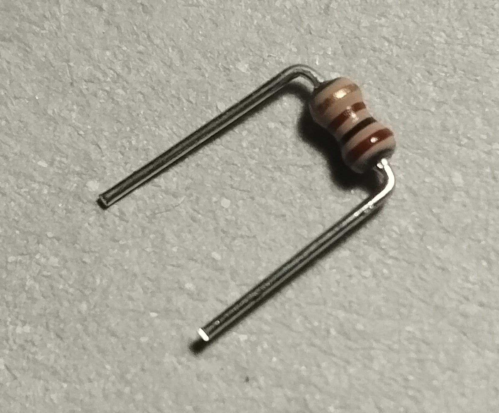

- There is one of these, marked R7 on the board
- The colour code on the resistor shows: BROWN-BLACK-BROWN-GOLD

## Step 4: 470Ω Resistor

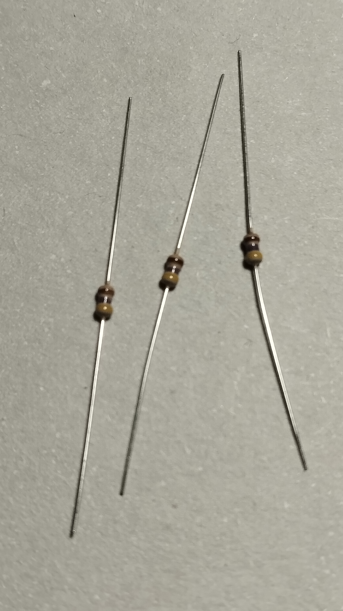

- There are 3 of these, marked R2, R3 and R4 on the board
- The colour code on each resistor shows: YELLOW-PURPLE-BROWN
- Orientation does not matter, it can be soldered either way round

## Step 5: 2k Resistor

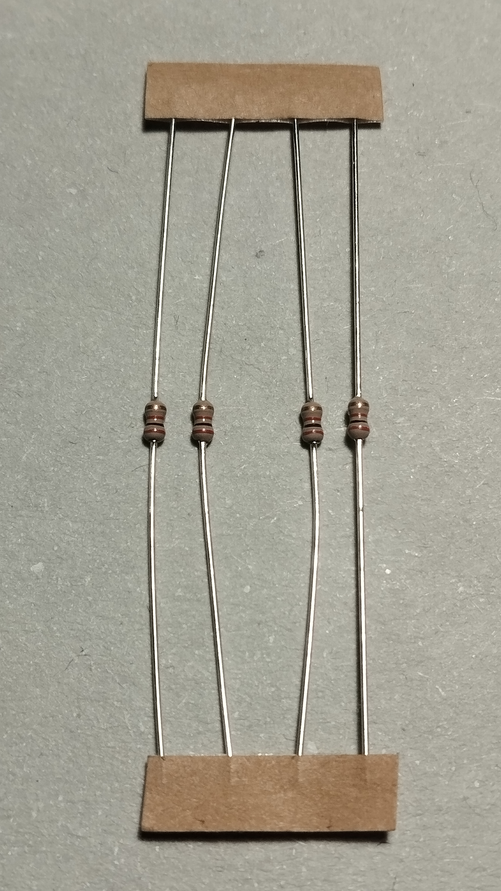

- There are 4 of these, marked R1, R5, R6 and R8 on the board
- The colour code on each resistor shows: RED-BLACK-RED-GOLD
- Orientation does not matter, it can be soldered either way round

## Step 6: 1N4148 Diode

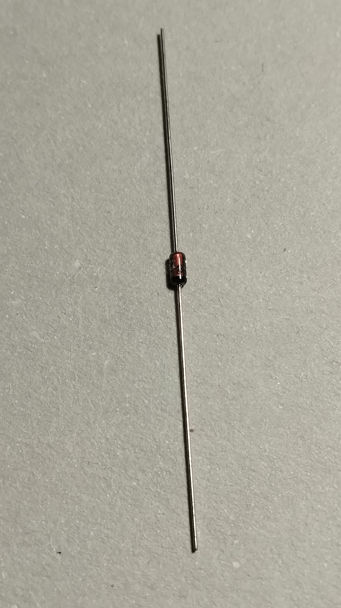

- There is just one of these, marked D1 on the board.
- Orientation here _does_ matter, the black line on the diode should align with
-- the white line and/or...
-- where the K is printed and/or...
-- the square pad

## Step 7: 100nF Cermamic Capacitor

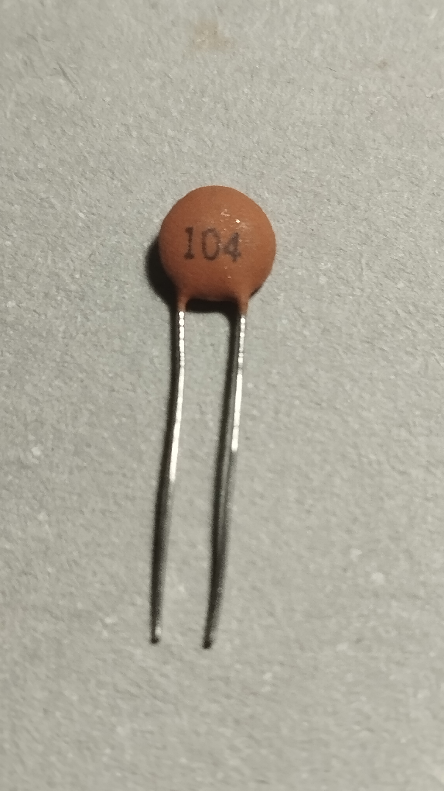

- There is just one of these, marked C1 on the board
- It can be identified by the number 104 printed on it
- Orientation does not matter, it can be soldered either way round

## Step 8: 2N3904 NPN Transistor

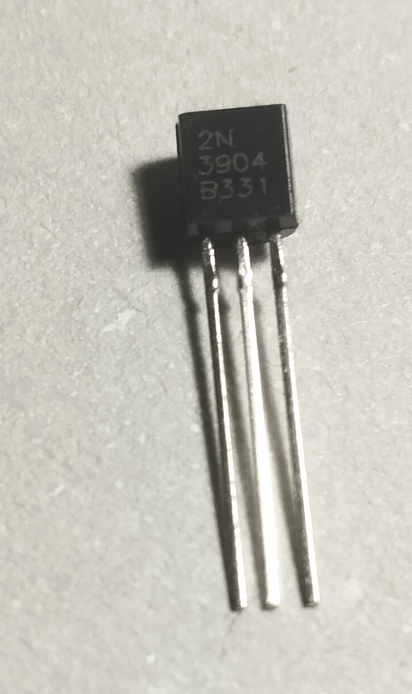

- There is just one of these, marked T1 on the board
- Orientation here _does_ matter - insert the transistor to match silk screen marking on the board

## Step 9: 5mm Red LED

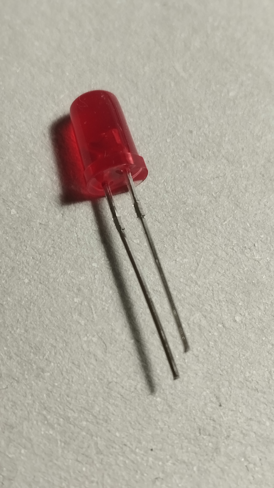

- There is just one of these, marked PWR_LED1 on the board
- Orientation here _does_ matter, the longest leg should go through the round pad (closest to the side marked A)

## Step 10: Speaker

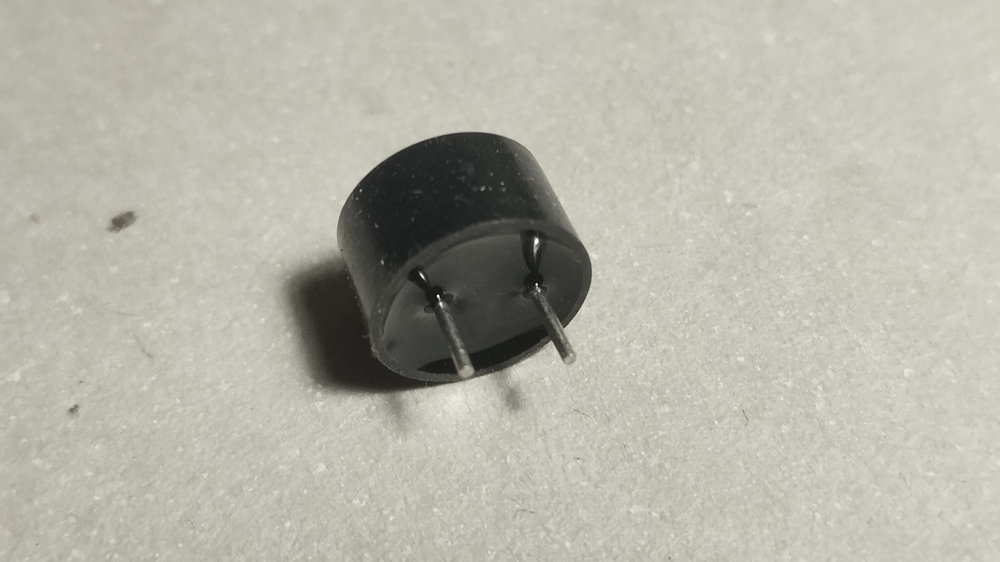

- There is just one of these, marked SPK1 on the board
- Orientation here _does_ matter, the leg marked with a plus sign (+) should go to the corresponding hole also marked with a plus sign (square pad)

## Step 11: 2-pin Programming Header

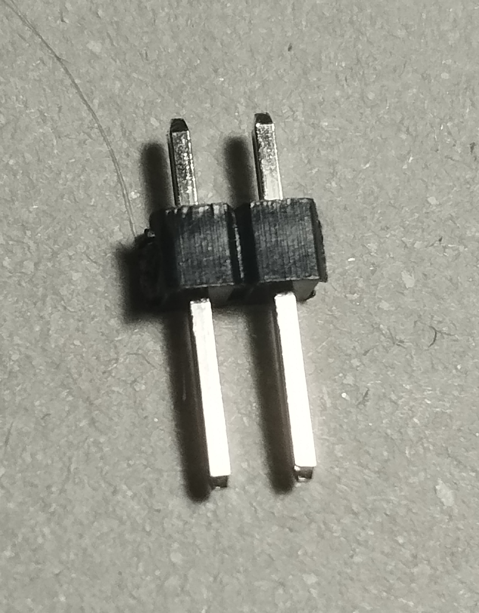

- There is just one of these, marked PGM/DBG1 on the board
- Orientation doesn't matter
- Be sure to solder it to the front side, the same as all other components

## Step 12: PS2 Keyboard Connector

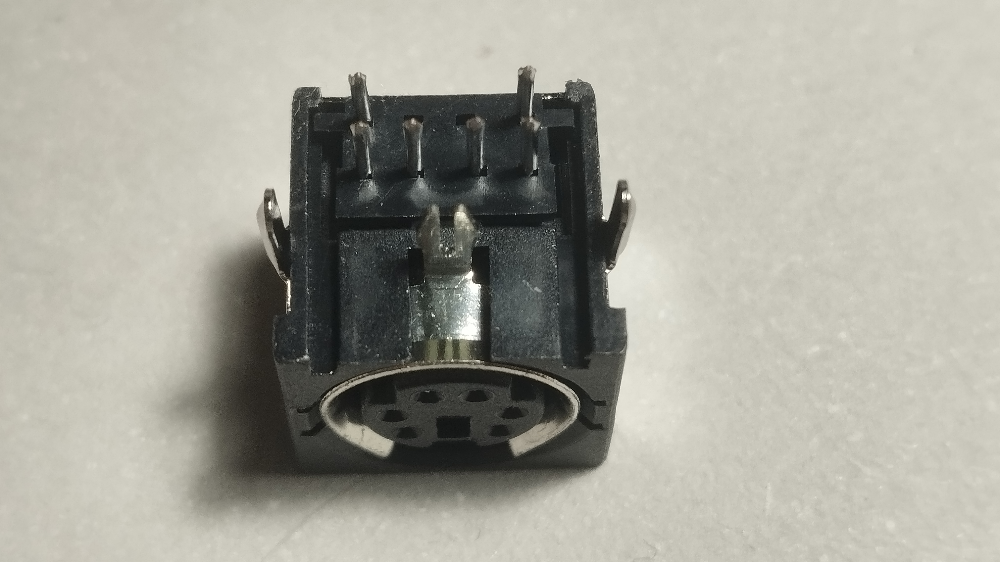

- There is just one of these, marked PS2_KBD1 on the board
- It can only be oriented one way
- The larger pins at either side are mounting pins, so don't strictly need solder to function electrically, but it helps for stability

## Step 13: VGA Connector

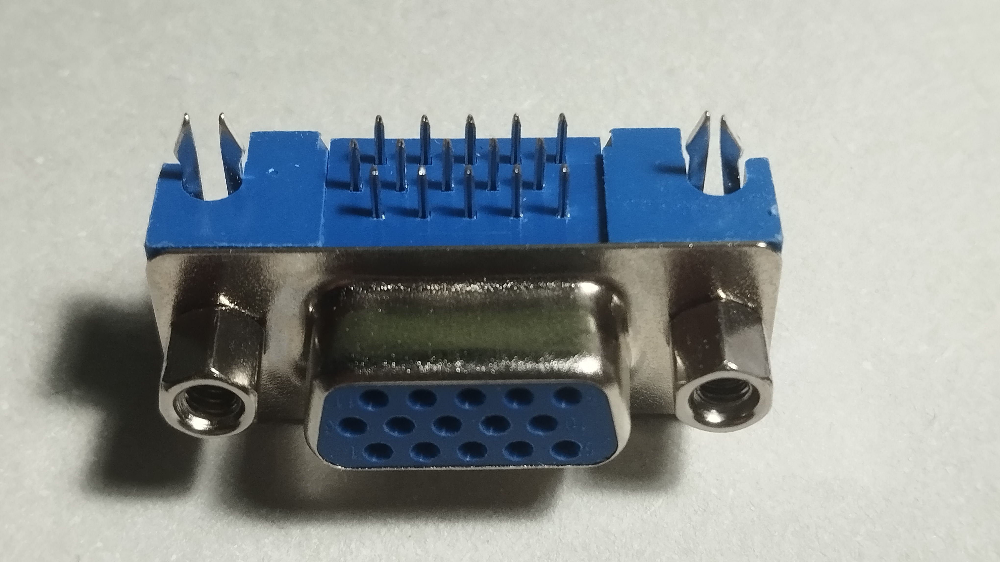

- There is just one of these, marked VGA1 on the board
- It can only be oriented one way around

## Step 14: Power Jack Connector

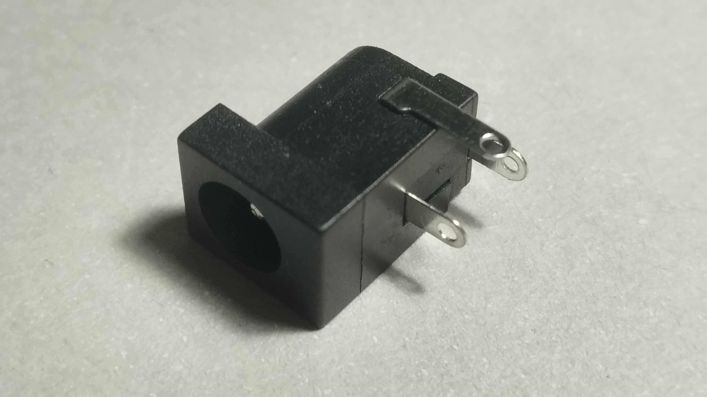

There is just one of these, marked PWR_JACK1 on the board

## Step 15: Bridging

- On the back side of the board, close to the VGA connector, you will see three pairs of small pads
- These define the colour of image on the screen (monochrome)
- If you don't connect at least one of these pairs, nothing will diplays
- In our experience, more than one can set of pads can be bridged to get secondary colours

## Step 16: First test

You can test your RVPC with the display and power cable you have been given. If you want to flash it, we have also set up one flashing station.

- Be sure to use a 5V USB power bank or phone charger and a USB to barrel jack cable, not a higher voltage standard power supply!

- When plugged/powered, the LED should light and the speaker should emit a short startup sound.

- It's normal for the screen to flicker a bit!

- Not all VGA monitors work with the RVPC. In general we found that older lower resolution monitors have a better chance to succeed