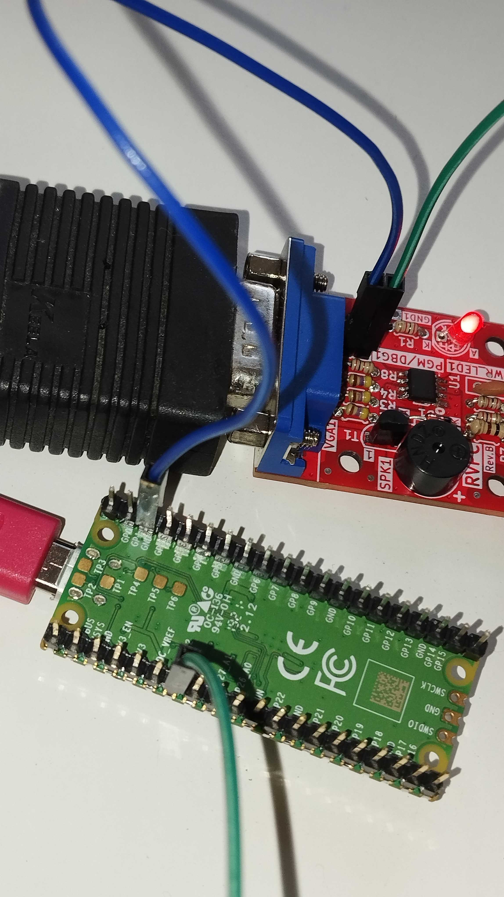

# Programming using Raspberry Pi Pico

In the original user manual the ESP32-S2-DevKitLiPo-USB is recommended as a programmer. However, here we describe a method to build and flash any of the demo RVPC firmwares onto the 
CH32V003 chip using a Raspberry Pi Pico and gdb. You will need a Raspberry Pi with pin headers attached. We used a (Pico 1)[https://www.raspberrypi.com/documentation/microcontrollers/pico-series.html#pico-1-technical-specification]

## Wiring

- Connect Pico's SWIO pin (pin GP28, physical pin 34 on my Pico 1) to RVPC PGM pin 
- Connect a Pico GND pin to RVPC GND pin
- Power RVPC as normal by providing 5V on barrel jack connector (e.g. USB to barrel jack converter)



## Programming Procedure

1. download the picorvd .uf2 firmware from our repo [here](./PROGRAMMER/picorvd.uf2).
2. NOTE: the original firmware can be found in the Actions tab of the original picorvd repo [here](https://github.com/aappleby/picorvd/actions). Click on the first entry in the list (for example) and scroll to the bottom of the page. However, recently when I checked there it was marked as 'expired'
3. hold BOOTSEL whilst connecting Pico via USB to your PC
4. drag .uf2 firmware onto drive that appears, wait for reboot
5. check Pico is appearing on /dev/ttyACM0, if not adjust accordingly in ./flash.sh
6. install dependencies:
`sudo apt-get install build-essential libnewlib-dev gcc-riscv64-unknown-elf libusb-1.0-0-dev libudev-dev gdb-multiarch`
7. install python-venv module for platformio extension: `sudo apt install python3-venv`
8. install Visual Studio Code as described [here](https://code.visualstudio.com/docs/setup/linux)
9. install Platform IO extension for VS Code as described [here](https://platformio.org/install/ide?install=vscode)
10. install CH32V-Platform as described [here](https://github.com/Community-PIO-CH32V/ch32-pio-projects?tab=readme-ov-file#installing-the-ch32v-platform)
11. clone this repo somewhere on your system i.e. `git clone https://github.com/fablabnk/RVPCWorkshop.git`
12. in VS Code, go to File -> Open Folder and navigate in the codebase to /RVPC/SOFTWARE/Demo-Tetris (or whichever example you prefer)
13. click PlatformIO icon (alien/ant head) and under Project Tasks -> RVPC -> General, click the Build task
14. back in the VS Code file explorer, firmware.elf should be found in ./pio/build/RVPC
15. right click and choose 'open containing folder', then right click again in blank space and choose 'open in terminal'
16. power cycle the RVPC
17. power cycle the Pico
18. flash from the terminal using the command: `gdb-multiarch -ex 'target extended-remote /dev/ttyACM0' -ex 'load' -ex 'detach' -ex 'quit' "firmware.elf"`

# Debugging the firmware (optional)

 - (optionally) add initial breakpoint programmatically (usually at the start of the main function):
    ```
    #if defined(__riscv)
        __asm__ volatile("ebreak");
    #endif
    ```
 - make sure you have `gdb-multiarch` (see dependencies in **flashing** section)
 - connect Raspberry to RVPC, powercycle rvpc, then powercycle raspberry or connect it to the Laptop/PC
 - in terminal navigate to the project directory
 - connect to the debugger with either:
   - in the terminal: run the command `gdb-multiarch -ex 'target extended-remote /dev/ttyACM0'  ".pio/build/RVPC/firmware.elf"`
   - in vscode create a debugging setting (or just copy the [launch.json](./SOFTWARE/launch.json) to .vscode directory of the project) and hit F5
 - do debugging
