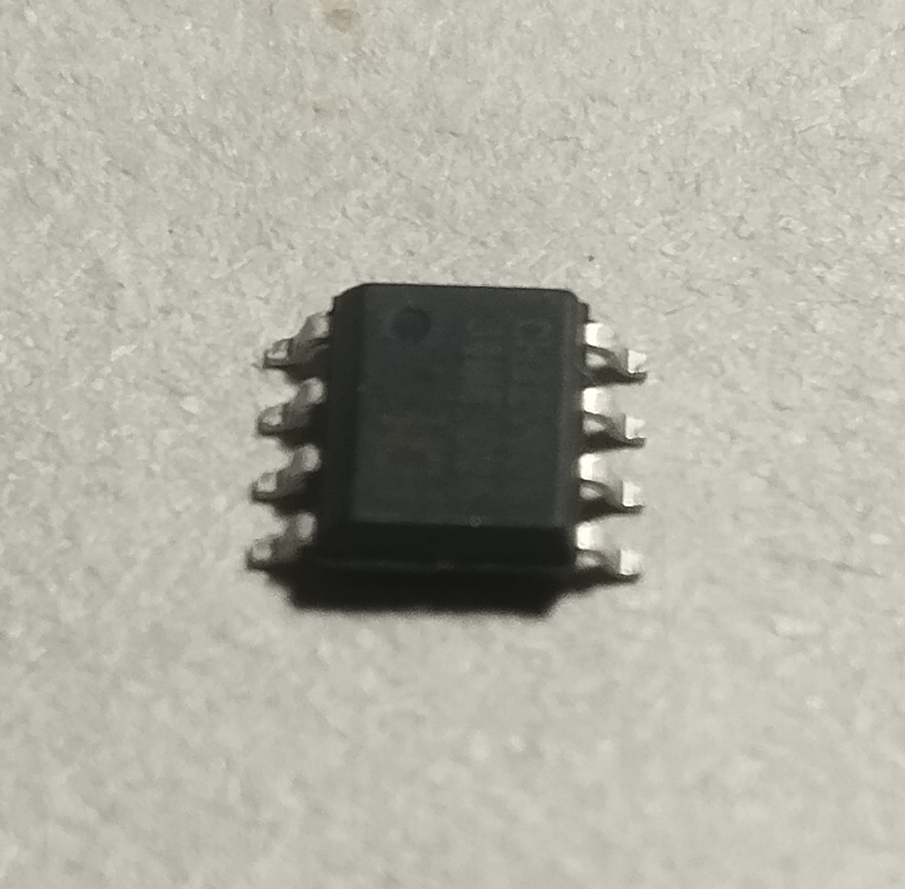
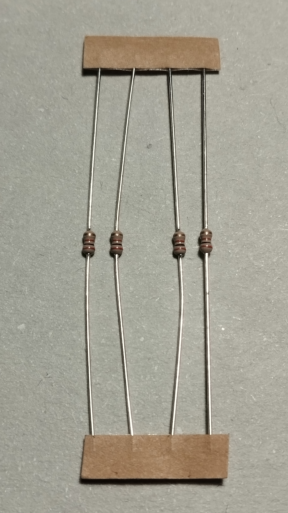
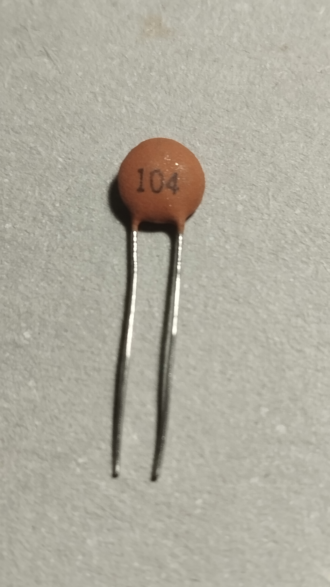
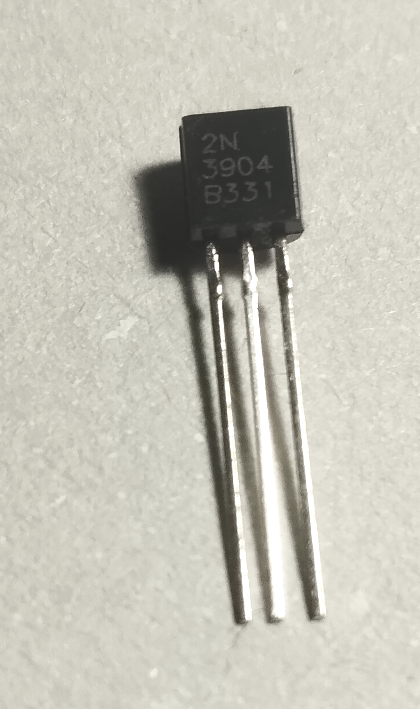
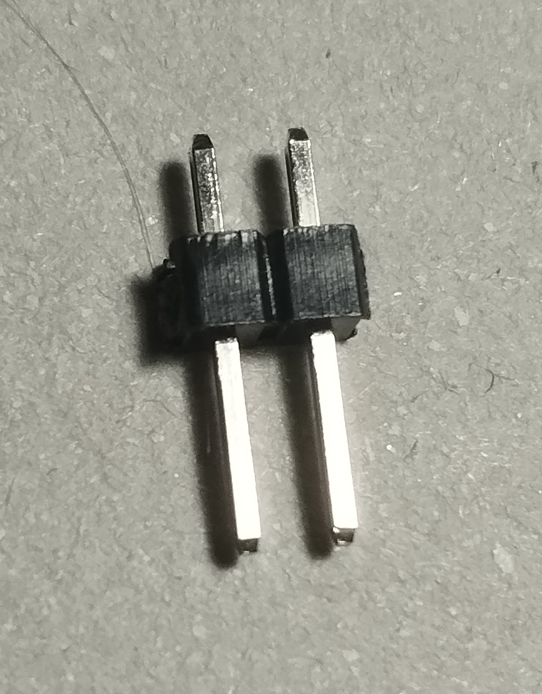
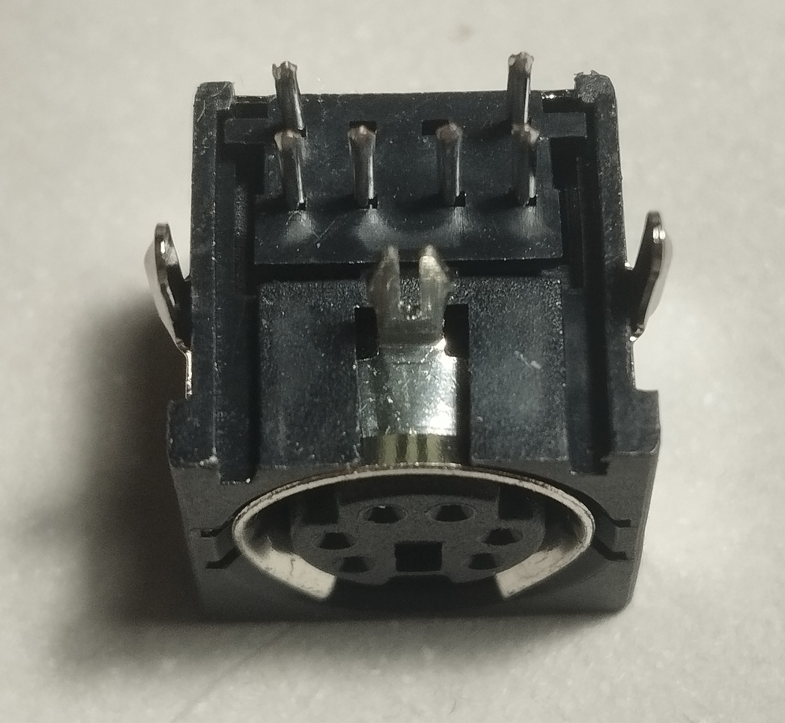

# About the Workshop


# About the RVPC project

https://github.com/OLIMEX/RVPC

The Olimex Risc-V personal computer with VGA and Keyboard and Woz like monitor. The purpose of this project is to make educational platform which people can use to learn RISCV assembler and experiment like in the old days in 1980s :)


 1. Build Guide show how to solder the RVPC
 2. Flashing alternative firmware to the CH32V003 chip using a Raspberry Pi Pico
 3. Code example for writing other display code


# RVPC Build Guide

To assemble our RVPC, we will follow the recommended order of assembly in the [user manual](./DOCUMENTS/RVPC-user-manual.pdf), adding a few extra clarifications, photos and tips.

Here is a photo showing the front side of the board once fully completed, highlighting the key components.


## Getting Started: Laying Out the Components 

Here is a summary - or Bill of Materials (BOM) - of all the components of the RVPC, in the recommended order of assembly that we will cover below

[table]

| Step | Number | Code | Description |
|------|--------|------|-------------|
| 0    | 1      | --   | Printed Circuit Board |
| 1    | 1      | U1   | CH32V003J4M6(SOP8) |
| 2    | 1      | R7   | 100R/1/8W BROWN-BLACK-BROWN-GOLD |
| 3    | 3      | R2, R3, R4 | 470R/1/8W YELLOW-PURPLE-BROWN |
| 4    | 4      | R1, R5, R6, R8 | 2k/1/8W RED-BLACK-RED-GOLD |
| 5    | 1      | D1   | 1N4148/DO35 The black line mark to K(square pad) |
| 6    | 1      | C1   | 100nF/25V/2010 104 |
| 7    | 1      | T1   | 2N3904 N-P-N transistor |
| 8    | 1      | PWR_LED1 | LED/PTH/5MM/RED Longest pin to A(round pad) |
| 9    | 1      | SPK1 | QMB-09B-03(1.5-5.0V_2.7kHz) Speaker |
| 10   | 1      | PGM/DBG1 | HN1x2 2 pin header |
| 11   | 1      | PS2_KBD1 | MDR6_MINI-DIN PS2 connector |
| 12   | 1      | VGA1 | HDR15-3.08-14.5T/VGA15 VGA connector |
| 13   | 1      | PWR_JACK1 | PWRJ-2mm(YDJ-1134) Power Jack |

## Step 0: Printed Circuit Board


This is where

## Step 1: CH32V003 RISC-V Microcontroller Unit (MCU)



There is just one of these, marked U1 on the board and it will be the brains of our PC.

This first component of the build is also perhaps the trickiest one to solder correctly. Not only does it have the smallest legs, it also differs from the others because it is a surface-mount (SMT) not through-hole (THT) component, meaning it is soldered to to front side of the board only.

If you are new to soldering, you may wish to skip ahead and start with one of the easier components, but be aware that the more of the other components you solder, the trickier it will be to - and you will not be able to use the hot plate method below.

There are two ways to approach this one. Whichever method you choose, it's good to have a pair of tweezers at hand

Sneeze, you lose

### Method 1: Hot plate

We have set up a table at the Hardware Hacking Area with a mini hot plate if you want to try this method

1. Place the RVPC circuit board on the hot plate
2. Place a small amount of solder paste on each of the U1 pads
3. Then heat the hot plate to the and wait until you you see the 

### Method 2: Soldering iron with fine tip

head

### Method 3: Hot-air rework station

This is another alternative to try, which we don't have at the congress, sadly...

## Step 2: 100R Resistor

Congratulations, from here on in it gets easier! The rest of the components in the build are all through-hole and a bit more human-friendly to work with. We insert them by

1. Placing their legs through the holes on the front side of the board
	- front side is the one which has graphics of the components themselves
2. Flipping the board (whilst holding the component in place)
3. Bending the legs to secure the position of the component
NOTE: bending


4. Soldering
	- it's good to flip the board after soldering, as 
	after two or more pins are solder, it gets trickier

5. Snipping
NOTE: turn the board away from you and others before performing the snip, as can hit you in the eye

If you are new to soldering, we recommend going . If you have more experience you may wish to batches


There is one of these, marked R7 on the board
The colour code on each resistor shows: BROWN-BLACK-BROWN-GOLD

## Step 3: 470R Resistor


There are 3 of these, marked R2, R3 and R4 on the board
The colour code on each resistor shows: YELLOW-PURPLE-BROWN
Orientation does not matter, it can be soldered either way round

## Step 4: 2k Resistor



There are 4 of these, marked R1, R5, R6 and R8 on the board
The colour code on each resistor shows: RED-BLACK-RED-GOLD
Orientation does not matter, it can be soldered either way round

## Step 5: 1N4148 Diode


There is just one of these, marked D1 on the board.

Orientation here _does_ matter, the black line on the diode should align with
- the white line
- where the K is printed
- the square pad

## Step 6: 100nF Cermamic Capacitor



There is just one of these, marked C1 on the board
It can be identified by the number 104 printed on it

## Step 7: 2N3904 Transistor



There is just one of these, marked T1 on the board
N-P-N 

## Step 8: 5mm Red LED


There is just one of these, marked PWR_LED1 on the board
Orientation here _does_ matter, the longest leg should go through the round pad (closest to the side marked A)

## Step 9: Speaker


There is just one of these, marked SPK1 on the board

## Step 10: 2-pin Programming Header



There is just one of these, marked PGM/DBG1 on the board

## Step 11: PS2 Keyboard Connector



There is just one of these, marked PS2_KBD1 on the board

## Step 12: VGA Connector


There is just one of these, marked VGA1  on the board

## Step 13: Power Jack Connector


There is just one of these, marked PWR_JACK1 on the board
# Programming using Raspberry Pi Pico

You will need a Raspberry Pi with pin headers. We used a (Pico 1)[https://www.raspberrypi.com/documentation/microcontrollers/pico-series.html#pico-1-technical-specification]

## Wiring

- Connect Pico's SWIO pin (pin GP28, physical pin 34 on my Pico 1) to RVPC PGM pin 
- Connect a Pico GND pin to RVPC GND pin
- Power RVPC as normal by providing 5V on barrel jack connector (e.g. USB to barrel jack converter)


# Flashing

- download the picorvd .uf2 firmware from our repo [here](./PROGRAMMER/picorvd.uf2).
- NOTE: the original firmware can be found in the Actions tab of the original picorvd repo [here](https://github.com/aappleby/picorvd/actions). Click on the first entry in the list (for example) and scroll to the bottom of the page. However, recently when I checked there it was marked as 'expired'
- hold BOOTSEL whilst connecting Pico via USB to your PC
- drag .uf2 firmware onto drive that appears, wait for reboot
- check Pico is appearing on /dev/ttyACM0, if not adjust accordingly in ./flash.sh
- install dependencies:
`sudo apt-get install build-essential libnewlib-dev gcc-riscv64-unknown-elf libusb-1.0-0-dev libudev-dev gdb-multiarch`
- install python-venv module for platformio extension: `sudo apt install python3-venv`
- install Visual Studio Code as described [here](https://code.visualstudio.com/docs/setup/linux)
- install Platform IO extension for VS Code as described [here](https://platformio.org/install/ide?install=vscode)
- install CH32V-Platform as described [here](https://github.com/Community-PIO-CH32V/ch32-pio-projects?tab=readme-ov-file#installing-the-ch32v-platform)
- clone this repo somewhere on your system i.e. `git clone https://github.com/fablabnk/RVPCWorkshop.git`
- in VS Code, go to File -> Open Folder and navigate in the codebase to /RVPC/SOFTWARE/Demo-Tetris (or whichever example you prefer)
- click PlatformIO icon (alien/ant head) and under Project Tasks -> RVPC -> General, click the Build task
- back in the VS Code file explorer, firmware.elf should be found in ./pio/build/RVPC
- right click and choose 'open containing folder', then right click again in blank space and choose 'open in terminal'
- power cycle the RVPC
- power cycle the Pico
- flash from the terminal using the command: `gdb-multiarch -ex 'target extended-remote /dev/ttyACM0' -ex 'load' -ex 'detach' -ex 'quit' "firmware.elf"`

# Debugging the firmware:

 - (optionally) add initial breakpoint programmatically (usually at the start of the main function):
    ```
    #if defined(__riscv)
        __asm__ volatile("ebreak");
    #endif
    ```
 - make sure you have `gdb-multiarch` (see dependencies in **flashing** section)
 - connect Raspberry to RVPC, powercycle rvpc, then powercycle raspberry or connect it to the Laptop/PC
 - in terminal navigate to the project directory
 - connect to the debugger with either:
   - in the terminal: run the command `gdb-multiarch -ex 'target extended-remote /dev/ttyACM0'  ".pio/build/RVPC/firmware.elf"`
   - in vscode create a debugging setting (or just copy the [launch.json](./SOFTWARE/launch.json) to .vscode directory of the project) and hit F5
 - do debugging

# Writing some display code

[coming soon]
